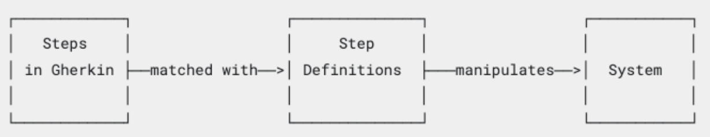

# Purpose
A tool to support Behavior-Driven Development (BDD)

# How it works

Cucumber reads executable specifications written in plain text and validates that the software does what those specifications say.

In order for Cucumber to understand the scenarios, it needs to follow Gherkin syntax. Gherkin documents are stored in .feature text files.

- Step Definitions : A method with an expression that links it to one or more Gherkin steps. These connect Gherkin steps to programming code.

  

# How to configure
1. build.gradle.kts
   ```kotlin
     testImplementation("io.cucumber:cucumber-jvm:7.11.0")
     testImplementation("io.cucumber:cucumber-java:7.11.0")
     testImplementation("io.cucumber:cucumber-junit-platform-engine:7.11.0")
     testImplementation("org.junit.platform:junit-platform-suite")
     testImplementation("org.junit.jupiter:junit-jupiter-api:5.8.1")
     testRuntimeOnly("org.junit.jupiter:junit-jupiter-engine:5.8.1")
   ```

# How to write test codes using cucumber 
([official guides to follow](https://cucumber.io/docs/guides/10-minute-tutorial/?lang=java))
1. Feature file
   a. Write a [feature file](../src/test/resources/cucumber/Is_it_friday_yet.feature) for cucumber to read and generate skeletons
      ```gherkin
         Feature: Is it Friday yet?
           Everybody wants to know when it's Friday
   
           Scenario Outline: Today is or is not Friday
           Given today is "<day>"
           When I ask whether it's Friday yet
           Then I should be told "<answer>"
   
           Examples:
            | day            | answer |
            | Friday         | TGIF   |
            | Sunday         | Nope   |
            | anything else! | Nope   |
   
   ```
     
2. Generating skeleton

    a. Run the test to get the skeletons from the terminal.
   ```
      $ ./gradlew test --info
   ```

    b. Skeleton will appear in the terminal saying there is undefined scenario and steps.
 
      


3. Write test codes
   
   a. Copy the skeleton generated and copied to a [test file](../src/test/kotlin/cucumber/IsItFridayYet.kt)
   
   b. If you run the test again, it throws PendingException saying implement the test codes. 

   c. Implement the codes and run the test again.  


# References
https://cucumber.io/docs/installation/kotlin/

https://cucumber.io/docs/guides/overview/

https://cucumber.io/docs/guides/10-minute-tutorial/?lang=java